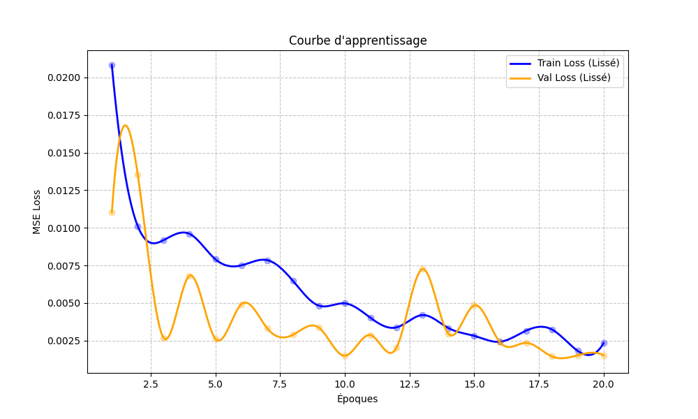
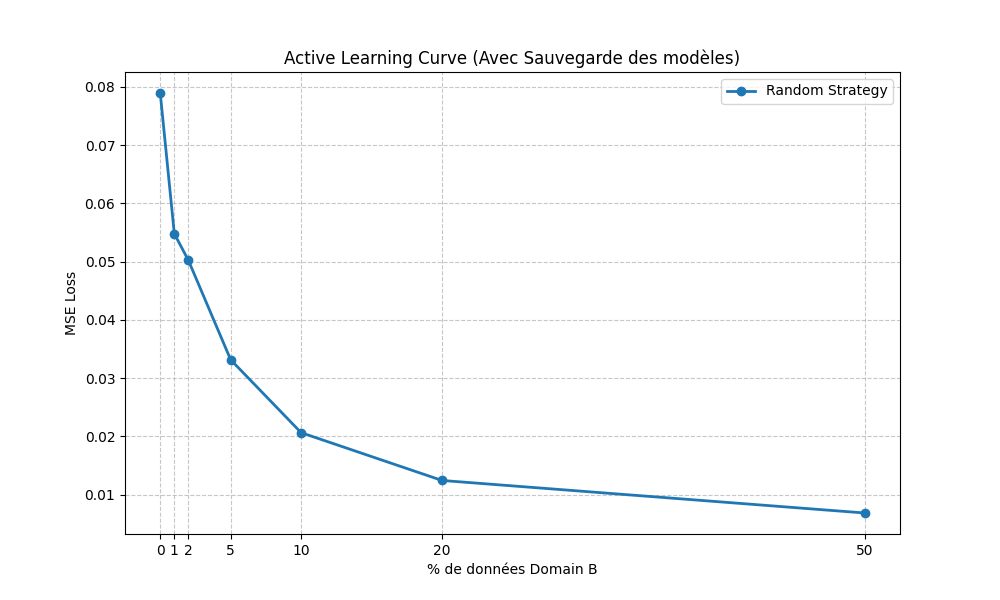
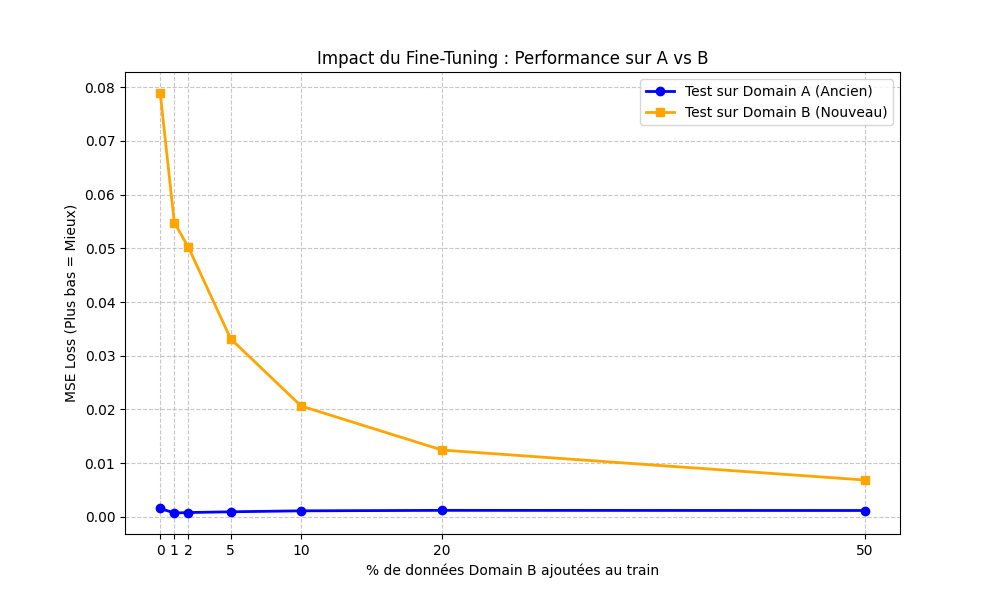

# ActiveLearning_Solo

# CR

# Sepration des data en train et en test
## Domain A
* 25 % des data sont pour le test
* 75 % des data sont pour le train

## Domain B
* 20 % des data sont pour le test
* 80 % des data sont pour le train

## Train Domain A

courbe d'apprentissage :

## Test du domain A

Graphique + MSE Loss

## Test du domain B avec uniquement entrainement sur le domain A

Graphique + MSE Loss

## Comparaison

Expliquer que l'entrainement sur le domain A est efficace mais pas suffisant pour apprendre par rapport a un seul environnement, donc mettre en place un domain B pour améliorer l'apprentissage

# Mise en place d'un systeme d'active learning
## Random

* Ajout de 1% des data du domain B au domain A pour train
* Ajout de 1% des data pour arriver a 2% du domain B au domain A pour le train
* Ajout de 3% des data pour arriver a 5% du domain B au domain A pour le train
* Ajout de 5% des data pour arriver a 10% du domain B au domain A pour le train
* Ajout de 10% des data pour arriver a 20% du domain B au domain A pour le train
* Ajout de 30% des data pour arriver a 50% du domain B au domain A pour le train

Grapgique de courbe d'apprentissage

## Test du random

Benchmark A vs B et explication

Explication 

---

# Adaptation de Domain et Apprentissage Actif pour la Régression sur Images

Ce projet explore l'efficacité des stratégies d'**Apprentissage Actif (Active Learning)** pour résoudre le problème du **décalage de distribution (Domain shift)** dans un contexte de régression visuelle (prédiction de coordonnées).

## 1. Contexte et Objectifs

L'objectif est d'adapter un modèle de régression (ResNet-18), entraîné sur un environnement initial (**domain A**), vers un nouvel environnement (**Domaine B**) en utilisant un minimum de données annotées. Nous utilisont une approche de *Fine-Tuning* progressif basée sur une sélection aléatoire (Random Sampling) pour établir une *baseline*.

---

## 2. Protocole Expérimental et Données

### 2.1. Architecture du Modèle

* **Modèle** : ResNet-18 pré-entraîné sur ImageNet.
* **Tâche** : Régression de coordonnées (X, Y).
* **Fonction de perte (Loss)** : MSE (Mean Squared Error).
* **Résolution d'entrée** : 1920x1080 (Full HD).

### 2.2. Jeux de Données (Datasets)

Les données sont divisées en deux domaines distincts (environnements différents).

| Domaine | Rôle | Train Split | Test Split | Description |
| --- | --- | --- | --- | --- |
| **Domaine A (Source)** | Apprentissage Initial | **75%** | **25%** | Environnement de référence sur lequel le modèle apprend initialement. |
| **Domaine B (Cible)** | Adaptation & Active Learning | **80%** | **20%** | Nouvel environnement. Le set "Train" sert de "Pool" non labellisé pour l'Active Learning. |

---

## 3. Phase 1 : Entraînement Supervisé (Domaine Source)

Le modèle a été entraîné exclusivement sur le Domaine A pour établir une performance de référence.

### 3.1. Courbe d'apprentissage (Train vs Val)

*Le modèle converge rapidement sans signe majeur de sur-apprentissage (overfitting), validant l'architecture choisie*

### 3.2. Performance sur le Test Set A

* **Métrique** : MSE Loss (Mean Squared Error).
* **Résultat visuel** : Le graphique de parité (Réel vs Prédit) montre une forte corrélation.

---

## 4. Phase 2 : Mise en évidence du "Domain Gap"

Avant toute adaptation, nous avons testé le modèle entraîné sur A directement sur les données du test du Domaine B.

### 4.1. Résultats (Inférence Directe)

* **MSE sur Domaine A** : `0.001529` (Faible)
* **MSE sur Domaine B** : `0.079102` (Élevée)

### 4.2. Analyse

L'augementation significative de l'erreur démontre un **Domain Shift**. Le modèle, bien que performant sur A, né généralise pas sur B car la distribution des pixels (éclairage, fond, position) a changé. L'entraînement sur A est nécessaire mais **insuffisant** pour le Domaine B. Cela justifie la mise en place d'une stratégie d'adaptation (Active Learning).

---

## 5. Phase 3 : Active Learning (Stratégie Random)

Nous avons simulé un scénario d'Active Learning où nous annotons progressivement des données du Domaine B pour adapter le modèle (Fine-Tuning).

### 5.1. Méthodologie

* **Stratégie** : Random Sampling (Sélection Aléatoire).
* **Budger** : Ajout cumulatif de données du pool B.
* Step 1 : 1% des données B.
* Step 2 : 2% (total).
* Step 3 : 5% (total).
* Step 4 : 10% (total).
* Step 5 : 20 % (total).
* Step 6 : 50% (total).

* **Technique** : À chaque étape, le modèle A est réchargé et *fine-tuné* sur le mélange `Train A + (Budget % du Train B)`.

### 5.2. Résultat : courbe d'Apprentissage Active

*Ce graphique illustre la réduction de l'erreur MSE sur le Domaine B en fonction du pourcentage de données annotées.*

### 5.3. Benchmark : Oubli Catastrophique (A vs B)

Nous avons évalué chaque modèle intermédiaire sur les deux domaines pour surveiller l'oubli catastrophique (*Catastrophic Forgetting*).

**Interprétation :**

* **Courbe Orange (Domaine B)** : L'erreur diminue drastiquement dès les premiers pourcentages, prouvant l'efficacité du Fine-Tuning.
* **Courbe Bleue (Domaine A)** : Le modèle a réussi à généraliser sans oublier ses connaissances antérieurs.

---

## 6. Conclusion Partielle

L'ajout progressif de données, même choisies aléatoirement, permet d'adapter efficacement le modèle au nouvel environnement. Avec seulement **[X]%** des données du Domaine B, nous atteignons une performance comparable à un entraînement complet.

**Prochaine étape** : Comparer cette stratégie "Random" avec une stratégie plus intelligente (basée sur l'incertitude ou l'entropie) pour voir si nous pouvons converger encore plus vite.

---

### Comment utiliser ce code

1. **Split des données** : Lancer `Python/IA/SplitTrainTest/DomainA/SplitDomainA.py` (et B `Python/IA/SplitTrainTest/DomainB/SplitDomainB.py`).
2. **Entraînement Source** : Lancer `Python/IA/Domain_A/train.py`.
3. **Test source** : Lancer `Python/IA/Domain_A/test_domainA.py`.
4. **Evidence "Domain Gap"** : Lancer `Python/IA/Domain_A/test_domainB.py`.
3. **Active Learning** : Lancer `Python/IA/Domain_B/active_learning_random.py`.
4. **Benchmark** : Lancer `Python/IA/Domain_B/test_Random_Strategy.py`.